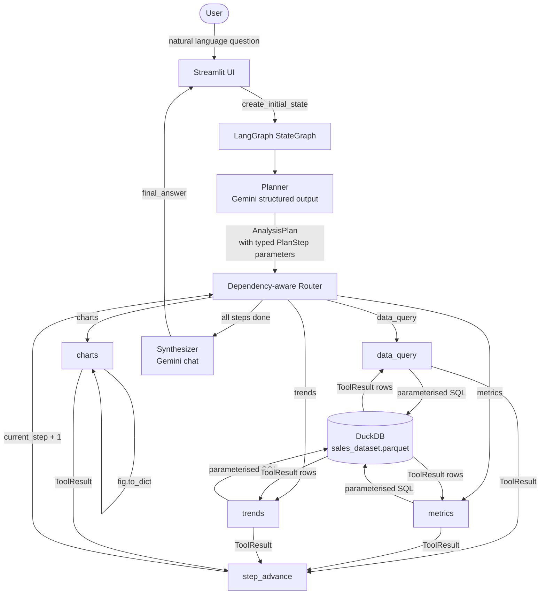

# Insight Copilot

Insight Copilot is a capability-oriented analytical agent built with LangGraph and Gemini that accepts natural-language questions about a structured dataset, produces an explicit investigation plan, executes deterministic Python/DuckDB analytical capabilities in dependency order, and synthesises the results into a grounded analyst-style answer — without the LLM ever computing a number itself.

---

## Overview

Insight Copilot is not a chatbot with SQL tools attached. It is an analytical agent structured around a hard architectural principle:

```
LLM decides.       →  What to investigate and in what order.
Deterministic code executes.  →  All SQL, aggregations, and chart rendering.
LLM explains.      →  Narration of verified evidence only.
```

When a user asks a question, a LangGraph `StateGraph` orchestrates an investigation:
the **Planner** classifies intent and produces a structured `AnalysisPlan` with typed
capability parameters; the **Router** dispatches to analytical capability nodes in
dependency order; each **capability node** runs a deterministic DuckDB query or
Plotly render and appends a `ToolResult` to state; the **Synthesizer** narrates the
evidence into a coherent answer. The full execution plan and tool trace are visible
in the UI — every answer is inspectable and reproducible.

---

## Problem

Most LLM-based data assistants either let the model hallucinate numbers or bury the
computation path inside an opaque agent loop. Insight Copilot solves this by enforcing
a hard boundary: the LLM is responsible for *language* (intent classification, planning,
narration) while Python and DuckDB are responsible for *all computation*. Users get
natural-language convenience without sacrificing analytical accuracy or transparency.

---

## Architecture



**Investigation workflow (not just question → tool → answer)**:

```
User question
      ↓
Investigation plan  (AnalysisPlan with PlanStep.depends_on)
      ↓
Capability selection  (Planner selects ordered steps)
      ↓
Dependency-aware execution  (Router validates before each dispatch)
      ↓
Deterministic evidence  (ToolResults from DuckDB and Plotly)
      ↓
Grounded synthesis  (LLM narrates only what the tools found)
```

---

## Dataset

**Canonical dataset**: `data/Sales_Dataset_2024.xlsx` — 2,000 rows, 10 columns,
full-year 2024 sales data.

**Runtime representation**: `data/sales_dataset.parquet` — auto-generated on first
run via `utils/data_loader.py`. All analytical queries target a DuckDB in-memory
view named `dataset` registered over the Parquet file.

| Column | Type | Role |
|---|---|---|
| `Date` | TIMESTAMP | Temporal axis for trend analysis |
| `Region` | VARCHAR | Geographic dimension |
| `Product` | VARCHAR | Product dimension |
| `Salesperson` | VARCHAR | Personnel dimension |
| `Category` | VARCHAR | Product category dimension |
| `Units_Sold` | DOUBLE | Quantity metric |
| `Unit_Price` | DOUBLE | Pricing metric |
| `Revenue` | DOUBLE | Revenue metric |
| `Cost` | DOUBLE | Cost metric |
| `Profit` | DOUBLE | Profit metric |

The source file is never modified. Data quality findings (e.g. negative profit rows)
are reported as observable evidence, not silently corrected.

---

## Analytical Capabilities

### Currently Implemented (Phase 1 & Phase 2 — Complete)

| Capability | What it does |
|---|---|
| `data_profile` | Dataset overview: row count, column types, missing values, cardinality, date range, numeric ranges, data quality warnings |
| `data_query` | Parameterised `SELECT` with column selection, equality filters, sorting, and limit (max 100 rows) |
| `metrics` | DuckDB `GROUP BY` aggregations: `SUM`, `AVG`, `COUNT`, `MIN`, `MAX`, `MEDIAN` |
| `trends` | `DATE_TRUNC`-based temporal aggregation at `day`, `week`, `month`, `quarter`, `year` granularity |
| `compare` | Side-by-side entity or period comparison with absolute and percentage deltas |
| `contribution` | Absolute and percentage contribution of segments to a total (`SUM() OVER ()`) |
| `profitability` | Revenue, cost, profit, and derived profit margin (`Profit / Revenue * 100`) |
| `variance` | Period-over-period growth and variance via `LAG()` window functions |
| `charts` | Plotly `bar`, `line`, `scatter` generation from prior `ToolResult` data — never queries DuckDB directly |

### Planned — Phase 3

| Capability | What it answers |
|---|---|
| `anomaly_detection` | "Any unusually large orders?" — IQR and z-score methods; no ML required |
| `correlation` | "Is there a relationship between Units_Sold and Revenue?" — `CORR()` with explicit causation disclaimer |
| `segmentation` | "Region × Category performance matrix" — multi-column `GROUP BY` |

All Phase 2 and Phase 3 capabilities are **not yet implemented**. Do not mistake the
roadmap for the current feature set.

---

## Agent Workflow

1. **User query** — typed into the Streamlit chat panel.
2. **Planning** — Planner sends the query (with conversation history and dataset schema)
   to Gemini, which returns a structured `AnalysisPlan`: an intent classification,
   a plain-English rationale, and an ordered list of `PlanStep` objects each containing
   typed parameters and `depends_on` references.
3. **Dependency-aware dispatch** — the Router reads `plan.steps[current_step]`,
   validates that all declared `depends_on` steps have completed successfully,
   then dispatches to the correct capability node.
4. **Deterministic execution** — each capability node validates its `PlanStep.parameters`
   against a Pydantic request schema, executes a parameterised DuckDB query or
   Plotly render, and appends a `ToolResult` to state.
5. **Multi-step loop** — `advance_step` increments `current_step`, control returns
   to the Router, which dispatches the next capability or exits to the Synthesizer
   when all steps are done.
6. **Grounded synthesis** — the Synthesizer receives the serialised `ToolResult`
   objects and produces a plain-English answer using only the data the tools returned.
   It is explicitly prohibited from inventing numbers.
7. **Final answer** — written to state; Streamlit renders it with any Plotly charts.

---

## Example Investigation

**User**: *"Why did profit decline in the second half of 2024?"*

This question requires a multi-step investigation, not a single tool call:

```
Step 1  trends       — Confirm profit trend by month. Does decline exist? When?
Step 2  compare      — H1 vs H2 total profit: exact absolute and % gap.
Step 3  contribution — Which regions/categories drove the largest change?
Step 4  profitability — Did revenue hold while margins compressed?
Step 5  charts       — Visualise the monthly profit trend from Step 1.

Synthesizer — Narrates Steps 1–5. Every claim cites a ToolResult.
              Cannot invent causes not evidenced by the data.
```

---

## Tech Stack

| Technology | Why |
|---|---|
| **Python 3.12** | Primary language. Modern typing, rich data ecosystem. |
| **LangGraph** | `StateGraph` for explicit, conditional, multi-step agent orchestration. Execution paths declared as graph edges — auditable and testable. |
| **Gemini (google-generativeai)** | LLM provider for planning and synthesis, accessed via an abstract `BaseLLM` interface. Swappable without changing agent code. |
| **Pydantic v2** | Validates all structured data crossing component boundaries (`AnalysisPlan`, `ToolResult`, capability request schemas). Catches malformed LLM output before it reaches the tools. |
| **DuckDB** | In-process OLAP engine for all analytical computation. Reads Parquet natively. SQL is explicit, auditable, and faster than Pandas chains for aggregation workloads. |
| **Pandas** | Data transport only — converts DuckDB results to `list[dict]`. Not used for computation. |
| **Plotly** | Interactive chart rendering. Chart tool produces `fig.to_dict()` dicts that Streamlit renders natively. |
| **Streamlit** | Chat UI and execution-plan trace panel. No JavaScript required. |
| **pytest** | Test runner. All offline tests run without a live API key or dataset file. |

---

## Project Structure

```
insight-copilot/
│
├── app.py                    # Streamlit entry-point
│
├── agent/                    # LangGraph graph and node implementations
│   ├── state.py              # AgentState TypedDict; create_initial_state()
│   ├── graph.py              # StateGraph wiring (nodes + edges)
│   ├── planner.py            # Planner node: LLM → AnalysisPlan
│   ├── router.py             # Router: conditional edge + advance_step node
│   └── synthesizer.py        # Synthesizer node: LLM → grounded final answer
│
├── tools/                    # Deterministic analytical capability nodes
│   ├── data_query.py         # Parameterised SELECT with filters and column selection
│   ├── metrics.py            # DuckDB GROUP BY aggregations
│   ├── trends.py             # DATE_TRUNC temporal aggregation
│   └── charts.py             # Plotly chart rendering from ToolResult data
│
├── llm/                      # LLM provider abstraction
│   ├── base.py               # BaseLLM abstract interface
│   ├── gemini.py             # Google Gemini implementation
│   └── factory.py            # create_llm() — provider selection
│
├── models/                   # Pydantic data contracts
│   └── schemas.py            # AnalysisPlan, PlanStep, ToolResult, request schemas, enums
│
├── utils/                    # Shared utilities
│   ├── prompts.py            # Centralised LLM system prompts
│   └── data_loader.py        # Excel → Parquet, DuckDB connection, schema metadata
│
├── data/                     # Dataset files (Excel + generated Parquet)
│
├── tests/                    # pytest test suite (73 tests, offline, no live API)
│   ├── test_data_layer.py    # Dataset loading, validation, DuckDB view
│   ├── test_data_query.py    # data_query tool
│   ├── test_metrics.py       # metrics tool with numerical assertions
│   ├── test_trends.py        # trends tool with temporal assertions
│   ├── test_charts.py        # charts tool, zero Streamlit dependency
│   ├── test_graph.py         # Graph construction and node set
│   ├── test_router.py        # Router logic and dependency validation
│   └── test_tools.py         # Tool node contract tests
│
├── docs/                     # Project documentation
│   ├── architecture.md       # Detailed architecture reference
│   ├── development-plan.md   # Phased roadmap with task checklist
│   └── decisions.md          # Architecture Decision Records (ADRs)
│
├── .streamlit/
│   └── config.toml           # Streamlit dark theme configuration
│
├── CONTRIBUTING.md           # Branching strategy, commit conventions, coding standards
├── .env.example              # Environment variable template
├── requirements.txt          # Python dependencies
└── pytest.ini                # Test discovery configuration
```

---

## Local Setup

### Prerequisites

- Python 3.12+
- A Gemini API key ([get one at aistudio.google.com](https://aistudio.google.com/app/apikey))
- `data/Sales_Dataset_2024.xlsx` placed in the `data/` directory

### Installation

```powershell
# 1. Clone the repository
git clone https://github.com/sankett28/insight-copilot.git
cd insight-copilot

# 2. Create and activate a virtual environment
python -m venv .venv
.venv\Scripts\Activate.ps1        # Windows PowerShell
# source .venv/bin/activate        # macOS / Linux

# 3. Install dependencies
pip install -r requirements.txt

# 4. Configure environment variables
copy .env.example .env
# Edit .env and set GEMINI_API_KEY
```

### Environment Variables

Copy `.env.example` to `.env`. **Never commit the `.env` file.**

```env
# Required — Gemini API key
GEMINI_API_KEY=your-gemini-api-key-here

# Optional — override the default model
GEMINI_MODEL=gemini-2.0-flash

# Optional — LLM provider (only "gemini" supported currently)
LLM_PROVIDER=gemini

# Optional — log verbosity
LOG_LEVEL=INFO
```

> `DATASET_PATH` is not required. The data loader automatically resolves
> `data/Sales_Dataset_2024.xlsx` relative to the project root.

---

## Running the Application

```powershell
streamlit run app.py
```

The application is served at `http://localhost:8501`.

---

## Testing

All offline tests run without a live API key or an active DuckDB server.

```powershell
# Run the full offline test suite (73 tests)
.venv\Scripts\pytest tests/ -v

# Run with coverage report
.venv\Scripts\pytest tests/ -v --cov=. --cov-report=term-missing

# Run a single test file
.venv\Scripts\pytest tests/test_metrics.py -v
```

Integration tests (require `GEMINI_API_KEY`) live in `tests/integration/` and
are excluded from the default test run. They are run manually during Phase 2
validation:

```powershell
.venv\Scripts\pytest tests/integration/ -v
```

---

## Deployment

The intended deployment target is **Streamlit Community Cloud**.

1. Push the repository to GitHub (`main` branch).
2. Connect the repository to [share.streamlit.io](https://share.streamlit.io).
3. Configure secrets via Streamlit Cloud Secrets panel:
   ```toml
   GEMINI_API_KEY = "your-key-here"
   ```
4. Ensure `data/Sales_Dataset_2024.xlsx` is committed to the repository
   (the Parquet runtime file is generated at startup and does not need to be committed).

> **Status**: Deployment not yet started. Planned for Phase 4.

---

## Development Status

| Area | Status |
|---|---|
| Project skeleton & contracts | ✅ Complete |
| `AgentState` & turn isolation | ✅ Complete |
| LangGraph graph wiring (9 nodes) | ✅ Complete |
| Router with dependency validation | ✅ Complete |
| Data layer: Excel → Parquet → DuckDB | ✅ Complete |
| `data_query` tool | ✅ Complete |
| `metrics` tool | ✅ Complete |
| `trends` tool | ✅ Complete |
| `charts` tool | ✅ Complete |
| Offline test suite (73 tests) | ✅ Complete |
| Planner node (skeleton) | 🔄 Interface complete — LLM integration untested |
| Synthesizer node (skeleton) | 🔄 Interface complete — LLM integration untested |
| Capability Registry | 🔲 Phase 2 |
| `data_profile` capability | 🔲 Phase 2 |
| `compare` capability | 🔲 Phase 2 |
| `contribution` capability | 🔲 Phase 2 |
| `profitability` capability | 🔲 Phase 2 |
| `variance` capability | 🔲 Phase 2 |
| Gemini planner integration (live) | 🔲 Phase 2 |
| Synthesizer grounding tests (live) | 🔲 Phase 2 |
| Multi-turn conversation (end-to-end) | 🔲 Phase 2 |
| Streamlit chat UI | 🔲 Phase 3 |
| Execution plan trace panel | 🔲 Phase 3 |
| Chart rendering in UI | 🔲 Phase 3 |
| `anomaly_detection` capability | 🔲 Phase 3 |
| `correlation` capability | 🔲 Phase 3 |
| `segmentation` capability | 🔲 Phase 3 |
| Evaluation suite (25 queries) | 🔲 Phase 4 |
| Deployment (Streamlit Cloud) | 🔲 Phase 4 |

---

## Architecture Decisions

Eight documented Architecture Decision Records (ADRs) explain the reasoning behind major technical choices:

→ [`docs/decisions.md`](docs/decisions.md)

Decisions covered: LangGraph over LangChain AgentExecutor, TypedDict vs Pydantic for state, DuckDB for computation, Gemini as initial LLM provider, structured vs free-form output split, visible execution plan instead of hidden chain-of-thought, deterministic tools over LLM-computed analytics, and centralised prompt management.

---

## Documentation

| File | Contents |
|---|---|
| [`docs/architecture.md`](docs/architecture.md) | System overview, Capability Registry design, all LangGraph nodes, state field reference, investigation workflow, conditional routing |
| [`docs/development-plan.md`](docs/development-plan.md) | Phased roadmap with task-level checklist; acceptance criteria per phase; capability implementation roadmap |
| [`docs/decisions.md`](docs/decisions.md) | 8 ADRs documenting all significant architectural choices |
| [`CONTRIBUTING.md`](CONTRIBUTING.md) | Branching strategy, commit message conventions, coding standards, module dependency rules |
