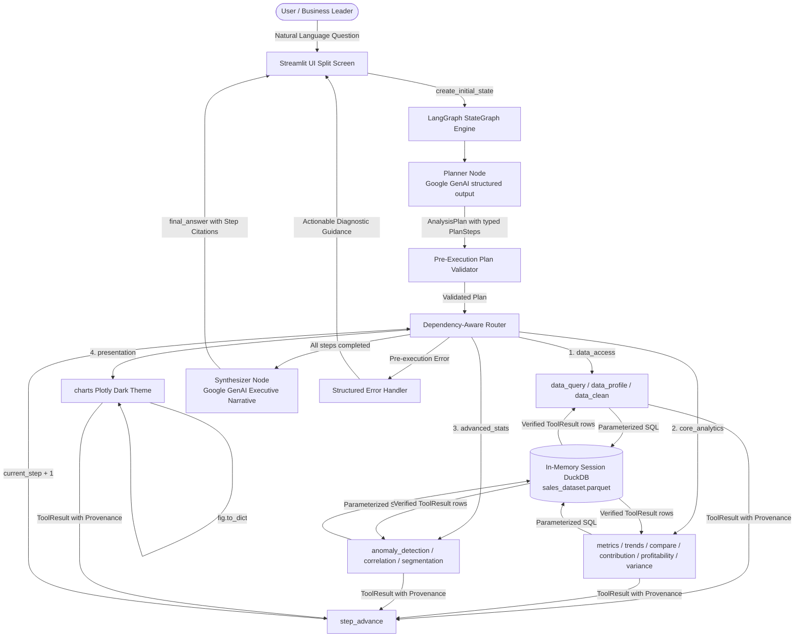

# Insight Copilot

Insight Copilot is an enterprise-grade analytical AI agent built with **LangGraph**, **Google GenAI**, **DuckDB**, **Pydantic**, and **Streamlit**. It accepts natural-language questions about structured business datasets, produces an explicit investigation plan, executes deterministic Python/DuckDB analytical capabilities in dependency order, and synthesises verified evidence into executive-ready answers with mandatory step citations — without the LLM ever hallucinating or computing a number itself.

---

## Architecture & Core Principle

Insight Copilot is built on a strict, auditable architectural principle:

```
LLM decides.       →  Plans investigation steps, parameter contracts, and dependencies.
Deterministic code executes.  →  Executes all SQL queries, data transformations, statistical tests, and charts in DuckDB/Python.
LLM explains.      →  Narrates verified ToolResults with mandatory [Step N] evidence citations.
```



---

## Authoritative Dataset

* **Canonical Source**: `data/Sales_Dataset_2024.xlsx` (2,000 transactions, 10 columns, full-year 2024 enterprise sales data).
* **Runtime Parquet**: `data/sales_dataset.parquet` auto-generated on first load.
* **Data Isolation Architecture**:
  * `raw_dataset`: Immutable Bronze view preserving original source rows.
  * `dataset`: Session-scoped Silver view supporting interactive dimension hygiene, case standardization, and typo clustering without polluting source data.

| Column | Data Type | Semantic Role | Analytical Description |
|---|---|---|---|
| `Date` | TIMESTAMP | Time | Temporal axis for daily, monthly, and quarterly time-series trends |
| `Region` | VARCHAR | Dimension | Geographic sales territory (`North`, `South`, `East`, `West`) |
| `Product` | VARCHAR | Dimension | Specific product item name |
| `Salesperson` | VARCHAR | Dimension | Account executive identifier |
| `Category` | VARCHAR | Dimension | Product taxonomy category (`Electronics`, `Furniture`, etc.) |
| `Units_Sold` | DOUBLE | Metric | Transaction quantity volume |
| `Unit_Price` | DOUBLE | Metric | Unit sales pricing |
| `Revenue` | DOUBLE | Metric | Total transaction revenue |
| `Cost` | DOUBLE | Metric | Recorded transaction cost |
| `Profit` | DOUBLE | Metric | Net transaction profit |

---

## Comprehensive Analytical Capabilities (13 Tools)

All capabilities validate typed Pydantic contracts and execute deterministically:

| Category | Capability | Description |
|---|---|---|
| **Data Access & Hygiene** | `data_profile` | Full dataset hygiene auditing: row counts, date spans, numeric summary statistics, null counts, categorical cardinality, and quality alerts. |
| | `data_query` | Parameterized SQL extraction with column selection, equality filters, sorting, and limit caps (max 100 rows). |
| | `data_clean` | Interactive dimension hygiene: casing standardization, Levenshtein typo clustering (e.g. `Easst` $\to$ `East`), and missing value imputation. |
| **Core Business Analytics** | `metrics` | Aggregated metrics (`SUM`, `AVG`, `COUNT`, `MIN`, `MAX`, `MEDIAN`) grouped by categorical dimensions with sorting and limits. |
| | `trends` | `DATE_TRUNC` temporal aggregation across `day`, `week`, `month`, `quarter`, and `year` granularities. |
| | `compare` | Entity A vs Entity B or period comparisons with absolute and percentage deltas. |
| | `contribution` | Percentage share of total window analysis (`SUM() OVER ()`) computed at population level before limit slicing. |
| | `profitability` | Revenue, cost, profit, and gross margin (`Profit / Revenue * 100`) with zero-revenue division guards. |
| | `variance` | Period-over-period delta and percentage growth rates computed using `LAG()` window functions. |
| **Advanced Statistics** | `anomaly_detection` | Statistical outlier detection using Interquartile Range (IQR) or Z-score thresholds with group-level bounding. |
| | `correlation` | Pearson correlation coefficient ($r$) with non-causal statistical caveats. |
| | `segmentation` | Multi-dimensional 2D cross-tabulation matrix across two distinct categorical dimensions. |
| **Presentation** | `charts` | Plotly dark-themed visualizations (`bar`, `line`, `scatter`) rendered from verified upstream `ToolResult` data. |

---

## Evaluation & Benchmark Harness

Insight Copilot includes a 35-case benchmark evaluation harness ([`tests/evaluation/`](tests/evaluation/)) validating intent classification, tool matching, parameter schema validity, and deterministic execution:

| Benchmark Metric | Target | Verified Score |
|---|---|---|
| **Planner Intent Accuracy** | $\ge 90\%$ | **100.0%** (35/35) |
| **Tool Selection Match** | $\ge 90\%$ | **100.0%** (35/35) |
| **Parameter Schema Validity** | $100\%$ | **100.0%** (35/35) |
| **Deterministic Execution Success** | $100\%$ | **100.0%** (31/31 in-domain) |

Detailed benchmark breakdown is documented in [`docs/evaluation-results.md`](docs/evaluation-results.md).

---

## Tech Stack

* **Language & Runtime**: Python 3.12+
* **Orchestration**: LangGraph StateGraph (DAG-based state machine)
* **LLM Architecture**: Provider-agnostic `BaseLLM` interface with `GeminiLLM` (production model: `gemini-3.5-flash`; local/development default: `gemini-3.5-flash-lite`) primary provider and optional `GroqLLM` (`openai/gpt-oss-120b`) fallback wrapped in `FallbackLLM`.
* **Contract Validation**: Pydantic v2
* **Analytical Engine**: In-memory DuckDB OLAP engine over Apache Parquet
* **Visualizations**: Plotly Graph Objects (dark-themed responsive charts)
* **User Interface**: Streamlit (split-screen layout with chat workspace, trace, SQL/data inspector, and telemetry)
* **Testing & Quality**: pytest with 212 automated regression unit tests

---

## Assignment Requirements Alignment

| Requirement | Implementation Verification |
|---|---|
| **LangGraph StateGraph** | Compiled DAG orchestration in `agent/graph.py` with static and conditional routing edges. |
| **Typed State** | `AgentState` TypedDict in `agent/state.py` with turn reset isolation (`create_initial_state`). |
| **Conditional Routing** | `router_node` in `agent/router.py` evaluating step dependencies (`depends_on`) dynamically. |
| **Visible Execution Plan / Rationale** | Displayed in real-time in the Analysis Inspector panel before tool execution. |
| **3+ Deterministic Tools** | 13 deterministic capabilities in `tools/` with Pydantic contracts and DuckDB SQL execution. |
| **Genuine Tool Selection & Multi-Tool Sequences** | Multi-step DAG planning (e.g. `data_clean` $\to$ `metrics` $\to$ `charts`). |
| **Insight Synthesis** | Synthesizer node in `agent/synthesizer.py` generating executive answers with mandatory `[Step N]` citations. |
| **Multi-Turn Conversation** | Full conversation history preserved across turns via `st.session_state["messages"]`. |
| **Public Hosted Deployment** | Deployed live on Streamlit Cloud with zero local setup required for evaluation. |
| **Architecture Documentation** | Complete suite in `docs/` (`architecture.md`, `decisions.md`, `development-plan.md`, `hardening-plan.md`, `evaluation-results.md`). |

---

## Local Setup & Quickstart

### Prerequisites
- Python 3.12+
- Gemini API Key ([Google AI Studio](https://aistudio.google.com/app/apikey))

### 1. Clone & Environment Setup
```powershell
# Clone the repository
git clone https://github.com/sankett28/insight-copilot.git
cd insight-copilot

# Create and activate virtual environment
python -m venv .venv
.venv\Scripts\Activate.ps1        # Windows PowerShell
# source .venv/bin/activate        # macOS / Linux

# Install dependencies
pip install -r requirements.txt
```

### 2. Configure Environment
```powershell
copy .env.example .env
# Edit .env and supply your GEMINI_API_KEY (and optional GROQ_API_KEY)
```

```env
GEMINI_API_KEY=your-gemini-api-key-here
GEMINI_MODEL=gemini-3.5-flash-lite   # local/development default; production uses gemini-3.5-flash
GROQ_API_KEY=your-groq-api-key-here
GROQ_MODEL=openai/gpt-oss-120b
LLM_PROVIDER=gemini
LOG_LEVEL=INFO
```

### 3. Run the Application
```powershell
streamlit run app.py
```
Open `http://localhost:8501` in your browser.

---

## Production Deployment & Secrets

Insight Copilot is deployed publicly on Streamlit Cloud. 

- **Bundled Dataset**: The canonical dataset `data/Sales_Dataset_2024.xlsx` is bundled in the repository, enabling immediate turn-key evaluation without uploading files.
- **Secrets Management**: No API keys or credentials are committed to version control (`.env` is `.gitignore`d). On Streamlit Cloud, keys are configured under **Advanced settings ➔ Secrets**:

```toml
GEMINI_API_KEY = "your_real_gemini_api_key"
GEMINI_MODEL = "gemini-3.5-flash"
GROQ_API_KEY = "your_real_groq_api_key"
GROQ_MODEL = "openai/gpt-oss-120b"
LLM_PROVIDER = "gemini"
```

---

## Running the Test Suite

```powershell
# Run full unit regression suite (212 tests passing, zero warnings)
.venv\Scripts\pytest tests/ --ignore=tests/integration -v

# Run automated evaluation & benchmark harness
.venv\Scripts\python tests/evaluation/run_eval.py --output docs/evaluation-results.md

# Run live integration tests (requires GEMINI_API_KEY)
.venv\Scripts\pytest tests/integration/ -v
```

---

## Architecture Decisions & Documentation

* [`docs/architecture.md`](docs/architecture.md): Detailed architectural components, graph state flow, and capability contracts.
* [`docs/decisions.md`](docs/decisions.md): Architecture Decision Records (ADRs 1–12).
* [`docs/development-plan.md`](docs/development-plan.md): Master development plan and phase deliverables.
* [`docs/hardening-plan.md`](docs/hardening-plan.md): Master multi-phase hardening plan and quality gates.
* [`docs/evaluation-results.md`](docs/evaluation-results.md): Full 35-case benchmark scorecard.
