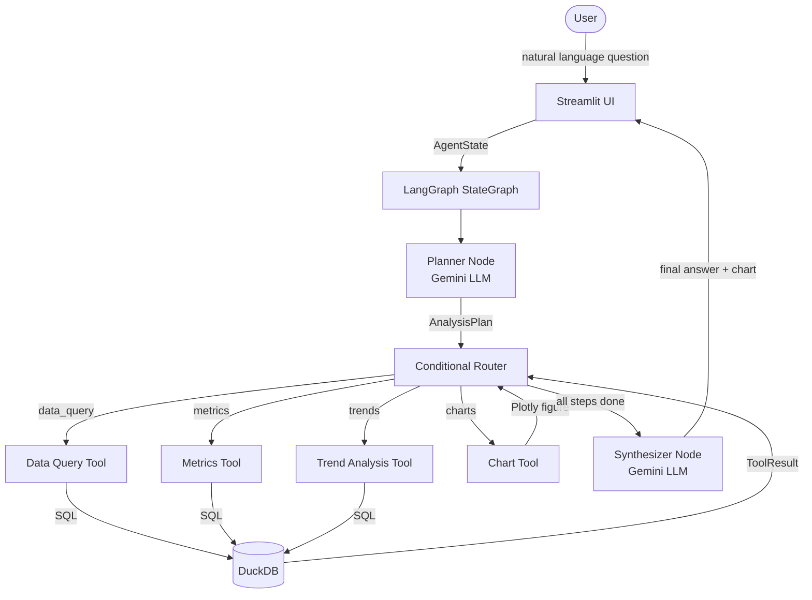

# Insight Copilot

Insight Copilot is a conversational analytical agent built with LangGraph and Gemini that accepts natural-language questions about a structured dataset, produces an explicit execution plan, runs deterministic Python/DuckDB analytical tools, and synthesises the results into a coherent insight — without the LLM ever computing a number itself.

---

## Overview

Insight Copilot exposes a dataset through a chat interface. When a user asks a question, a LangGraph `StateGraph` orchestrates the following: the Planner LLM node classifies intent and produces a structured execution plan; the Router dispatches to one or more analytical tool nodes in sequence; each tool runs a deterministic DuckDB query or Plotly render; and the Synthesizer LLM node narrates the results back to the user. The full execution plan and tool trace are visible in the UI, making every answer inspectable and reproducible.

---

## Problem

Most LLM-based data assistants either let the model hallucinate numbers or bury the computation path inside an opaque agent loop. Insight Copilot solves this by enforcing a hard boundary: the LLM is responsible for language (intent classification, planning, narration) while Python and DuckDB are responsible for all computation. Users get natural-language convenience without sacrificing analytical accuracy or transparency.

---

## Architecture



---

## Agent Workflow

1. **User query** — the user types a natural-language question into the Streamlit chat panel.
2. **Planning** — the Planner node sends the query (with conversation history) to Gemini, which returns a structured `AnalysisPlan`: an intent classification, a plain-English rationale, and an ordered list of tool steps.
3. **Tool selection** — the plan's `selected_tools` list is written to `AgentState`. The Router reads it to decide which node to call first.
4. **Tool execution** — the Router dispatches to the correct tool node. Each tool runs a deterministic DuckDB query or Plotly render and appends a `ToolResult` to the state.
5. **Multi-step execution** — after each tool completes, `advance_step` increments the step counter and control returns to the Router, which dispatches the next tool. This loop continues until all steps are complete.
6. **Result synthesis** — once all steps are done, the Router sends control to the Synthesizer node. Gemini receives the serialised `ToolResult` objects and produces a plain-English analyst-style answer. It is explicitly instructed not to invent any numbers.
7. **Final insight** — the answer (and any Plotly charts) are written back to the Streamlit UI.

---

## Tech Stack

| Technology | Why it is used |
|---|---|
| **Python 3.12** | Primary language. Modern syntax, strong typing, rich data ecosystem. |
| **LangGraph** | Provides the `StateGraph` primitive for explicit, conditional, multi-step agent orchestration. Chosen over bare LangChain because execution paths are declared as graph edges — auditable and testable. |
| **Gemini (google-generativeai)** | LLM provider for planning and synthesis. Used via an abstract `BaseLLM` interface so the provider can be swapped without changing agent code. |
| **Pydantic v2** | Validates all structured data that crosses component boundaries (`AnalysisPlan`, `ToolResult`, `AgentState` schemas). Catches malformed LLM output before it reaches the tools. |
| **DuckDB** | In-process OLAP engine for all analytical computation. Reads CSV/Parquet/Excel directly. Chosen over Pandas chains because SQL is explicit, auditable, and faster for aggregations on larger datasets. |
| **Pandas** | Data transport layer between DuckDB and the rest of the application. Used for serialisation (`.to_dict()`), not for computation. |
| **Plotly** | Interactive chart rendering. The Chart tool produces `fig.to_dict()` dicts that Streamlit renders natively. |
| **Streamlit** | Rapid UI framework for the chat interface and execution-plan trace panel. No JavaScript required. |
| **pytest** | Test runner. All tests are pure Python with mocked LLMs — no live API calls required to run the suite. |

---

## Tools

All tools are deterministic Python functions. The LLM does not call them directly; the Router dispatches to them based on the structured plan.

### Data Query Tool

**File**: [`tools/data_query.py`](tools/data_query.py)

Retrieves filtered rows from the dataset using a parameterised DuckDB `SELECT`. Accepts column selection, equality filters, and a row limit. Returns a list of row dicts. Used as the foundation for any question that needs raw data before aggregation.

> **Status**: Interface defined. DuckDB implementation pending (Phase 1).

### Metrics Tool

**File**: [`tools/metrics.py`](tools/metrics.py)

Computes aggregated numeric metrics via DuckDB `GROUP BY` queries. Supports `SUM`, `AVG`, `COUNT`, `MIN`, `MAX`, and `MEDIAN`. Optionally returns the top-N rows ordered by the metric. Used for questions like "top 5 products by revenue" or "average discount by category".

> **Status**: Interface defined. DuckDB implementation pending (Phase 1).

### Trend Analysis Tool

**File**: [`tools/trends.py`](tools/trends.py)

Analyses a numeric measure over an ordered dimension (typically time) using DuckDB window functions. Supports time series aggregation, rolling averages, period-over-period change, and cumulative totals. Used for questions about growth, seasonality, and momentum.

> **Status**: Interface defined. DuckDB implementation pending (Phase 1).

### Chart Tool

**File**: [`tools/charts.py`](tools/charts.py)

Renders a Plotly figure from data produced by a preceding tool. Supports bar, line, scatter, pie, area, and heatmap chart types. The tool does not query the database — it only transforms an existing `ToolResult` into a visual representation. Returns a `fig.to_dict()` that Streamlit renders natively.

> **Status**: Interface defined. Plotly implementation pending (Phase 1).

---

## Dataset

**Selected dataset**: [Superstore Sales Dataset](https://www.kaggle.com/datasets/vivek468/superstore-dataset-final)

### What it contains

A US retail orders dataset with approximately 10,000 rows and 21 columns, covering the period 2014–2017. Key columns include:

| Column | Type | Description |
|---|---|---|
| `Order Date` | date | Date the order was placed |
| `Ship Date` | date | Date the order shipped |
| `Segment` | string | Customer segment (Consumer, Corporate, Home Office) |
| `Region` | string | US region (East, West, Central, South) |
| `Category` | string | Product category (Furniture, Office Supplies, Technology) |
| `Sub-Category` | string | Product sub-category (28 values) |
| `Product Name` | string | Individual product name |
| `Sales` | float | Order line revenue |
| `Quantity` | int | Units ordered |
| `Discount` | float | Discount applied (0.0–0.8) |
| `Profit` | float | Order line profit |

### Why it was selected

- Covers multiple analytical dimensions (time, geography, category, segment) that exercise all four tool types.
- Small enough (< 1 MB) to load into DuckDB in-process without any infrastructure.
- Well-understood structure — suitable for demonstrating the agent's planning behaviour without ambiguity.
- Freely available, with no licensing restrictions for academic use.

### How it is loaded

The dataset file (CSV, Parquet, or Excel) is placed in the `data/` directory and registered as a DuckDB in-process view named `dataset` via `utils/data_loader.py`. The file path is configured through the `DATASET_PATH` environment variable.

> **Status**: `data_loader.py` interface defined. File ingestion implementation pending (Phase 1).

### Assumptions

- The `Order Date` and `Ship Date` columns are parseable as dates.
- Currency is uniformly USD.
- No deduplication or cleaning is applied at load time in Phase 0.

---

## Reasoning / Execution Plan

Insight Copilot does not expose hidden chain-of-thought. Instead, the Planner produces a structured `AnalysisPlan` that is surfaced in the UI before execution begins.

**Example**

*User query*: "Which region has the highest profit margin, and how does it break down by category?"

```
Intent:   metrics

Rationale:
  The question asks for an aggregated ratio (profit margin = profit / sales)
  grouped first by region, then by category within the top region.
  Two sequential metric queries are sufficient; no trend or chart is needed
  unless the user requests one.

Steps:
  1. metrics  — calculate profit margin by region, ranked descending
  2. metrics  — calculate profit margin by category within the top region
```

The plan is written to `AgentState` and rendered in the Streamlit trace panel before the tools execute.

---

## Multi-turn Conversation

Conversation history is maintained in `AgentState["messages"]`, a list of `Message` objects (role + content) accumulated across turns using a LangGraph `operator.add` reducer. On each new query, the Planner receives the last 10 messages as context, allowing it to resolve references like *"show me a chart of that"* or *"filter to the West region"* without the user repeating prior context.

---

## Project Structure

```
insight-copilot/
│
├── app.py                    # Streamlit entry-point
│
├── agent/                    # LangGraph graph and node implementations
│   ├── state.py              # AgentState TypedDict — shared graph memory
│   ├── graph.py              # StateGraph wiring (nodes + edges)
│   ├── planner.py            # Planner node: LLM → AnalysisPlan
│   ├── router.py             # Router: conditional edge + advance_step node
│   └── synthesizer.py        # Synthesizer node: LLM → final answer
│
├── tools/                    # Deterministic analytical tools (no LLM)
│   ├── data_query.py         # DuckDB SELECT with filters and column selection
│   ├── metrics.py            # DuckDB GROUP BY aggregations
│   ├── trends.py             # DuckDB window functions for time-series analysis
│   └── charts.py             # Plotly chart rendering from ToolResult data
│
├── llm/                      # LLM provider abstraction
│   ├── base.py               # BaseLLM abstract interface
│   ├── gemini.py             # Google Gemini implementation
│   └── factory.py            # create_llm() — provider selection
│
├── models/                   # Pydantic data contracts
│   └── schemas.py            # AnalysisPlan, ToolResult, Message, enums
│
├── utils/                    # Shared utilities
│   ├── prompts.py            # Centralised LLM system prompts
│   └── data_loader.py        # DuckDB dataset ingestion
│
├── data/                     # Dataset files (git-ignored)
│   └── README.md             # Dataset placement instructions
│
├── tests/                    # pytest test suite
│   ├── test_graph.py         # Graph construction tests
│   ├── test_router.py        # Router logic and step-advance tests
│   └── test_tools.py         # Tool node stubs and interface tests
│
├── docs/                     # Project documentation
│   ├── architecture.md       # Detailed architecture reference
│   ├── development-plan.md   # Phased roadmap with checkboxes
│   └── decisions.md          # Architecture Decision Records (ADRs)
│
├── .streamlit/
│   └── config.toml           # Streamlit theme configuration
│
├── CONTRIBUTING.md           # Branching strategy, commit conventions, coding standards
├── .env.example              # Environment variable template
├── requirements.txt          # Python dependencies
└── pytest.ini                # Test discovery configuration
```

---

## Local Setup

### Prerequisites

- Python 3.12+
- A Gemini API key ([get one here](https://aistudio.google.com/app/apikey))
- The Superstore dataset CSV placed in `data/`

### Installation

```bash
# 1. Clone the repository
git clone https://github.com/sankett28/insight-copilot.git
cd insight-copilot

# 2. Create a virtual environment
python -m venv .venv

# Activate — Windows (PowerShell)
.venv\Scripts\Activate.ps1

# Activate — macOS / Linux
source .venv/bin/activate

# 3. Install dependencies
pip install -r requirements.txt

# 4. Configure environment variables
copy .env.example .env      # Windows
cp .env.example .env        # macOS / Linux
# Edit .env and fill in the required values (see below)
```

---

## Environment Variables

Copy `.env.example` to `.env` and set the following values.
**Never commit the `.env` file.**

```env
# Required — Gemini API key
GEMINI_API_KEY=your-gemini-api-key-here

# Optional — override the default model (gemini-2.0-flash)
GEMINI_MODEL=gemini-2.0-flash

# Optional — LLM provider (only "gemini" is supported currently)
LLM_PROVIDER=gemini

# Required — path to the dataset file
DATASET_PATH=data/superstore.csv

# Optional — log verbosity
LOG_LEVEL=INFO
```

---

## Running Locally

```bash
streamlit run app.py
```

The application is served at `http://localhost:8501` by default.

---

## Testing

```bash
# Run the full test suite
pytest tests/ -v

# Run with coverage report
pytest tests/ -v --cov=. --cov-report=term-missing

# Run a single test file
pytest tests/test_router.py -v
```

All tests run without a live API key or dataset file. The LLM is mocked at the `BaseLLM` interface level and DuckDB tests (Phase 1) will use in-memory databases with synthetic data.

---

## Deployment

The intended deployment target is **Streamlit Community Cloud**.

1. Push the repository to GitHub (the `main` branch is the deployment source).
2. Connect the repository to [share.streamlit.io](https://share.streamlit.io).
3. Configure secrets through the Streamlit Cloud **Secrets** panel (not environment files):
   ```toml
   GEMINI_API_KEY = "your-key-here"
   DATASET_PATH = "data/superstore.csv"
   ```
4. The dataset file must be committed to the repository or fetched at startup; it is not uploaded separately.

> **Status**: Deployment configuration not yet started.

---

## Architecture Decisions

Seven documented Architecture Decision Records (ADRs) explain the reasoning behind major technical choices:

→ [`docs/decisions.md`](docs/decisions.md)

Decisions covered: LangGraph over LangChain AgentExecutor, TypedDict vs Pydantic for state, DuckDB for computation, Gemini as initial LLM provider, structured vs free-form output split between planner and synthesizer, no hidden chain-of-thought, and centralised prompt management.

---

## Development Status

| Area | Status |
|---|---|
| Project skeleton | ✅ Complete |
| Agent state (`AgentState`) | ✅ Complete |
| LangGraph graph wiring | ✅ Complete |
| Planner node | ✅ Skeleton — interface complete, LLM integration untested |
| Router node | ✅ Complete |
| Synthesizer node | ✅ Skeleton — interface complete, LLM integration untested |
| Data query tool | 🔲 Stub only — interface defined, DuckDB logic pending |
| Metrics tool | 🔲 Stub only — interface defined, DuckDB logic pending |
| Trend analysis tool | 🔲 Stub only — interface defined, DuckDB logic pending |
| Chart tool | 🔲 Stub only — interface defined, Plotly logic pending |
| `data_loader` utility | 🔲 Interface defined, file ingestion pending |
| Streamlit UI | 🔲 Layout shell only — no live agent connection |
| Multi-turn conversation | 🔲 State structure defined, not wired to UI |
| Tests | ✅ 27 passing — graph, router, tool stubs |
| Documentation | ✅ Complete for current phase |
| Deployment | 🔲 Not started |

---

## Known Limitations

- **Tools are stubs.** The four analytical tools (`data_query`, `metrics`, `trends`, `charts`) return placeholder `ToolResult` objects with `success=False`. No real computation occurs yet.
- **No live UI.** The Streamlit app renders a layout shell. It is not yet connected to the LangGraph agent.
- **LLM integration untested end-to-end.** `GeminiLLM` is implemented but has not been exercised in an integration test with a real API key.
- **Single dataset assumption.** The data layer is designed for one pre-loaded dataset per session. Dynamic dataset switching is not supported.
- **No input validation on the Streamlit side.** The UI does not yet validate or sanitise user input before passing it to the agent.

---

## Future Improvements

- **Phase 1**: Implement all four tool functions with real DuckDB queries and Plotly renders.
- **Phase 2**: End-to-end LLM integration — planner produces valid plans on real queries, synthesizer narrates real results.
- **Phase 3**: Full Streamlit UI — chat panel, execution-plan trace, chart rendering.
- **Prompt iteration**: Evaluate planner accuracy on 20+ sample queries and refine the system prompt.
- **Additional LLM providers**: Add `OpenAILLM` behind the existing `BaseLLM` abstraction.
- **Schema injection**: Pass the dataset column schema to the planner so it can generate more accurate tool parameters.
- **Export**: Allow users to download query results and charts as CSV/PNG.
