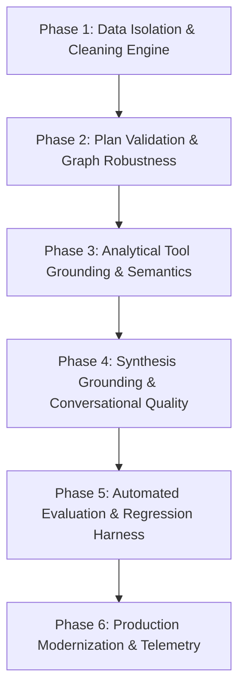

# Hardening & Reliability Plan — Insight Copilot

> **Status**: Approved Blueprint / Active Execution Roadmap  
> **Target Version**: Insight Copilot v1.0 Production Hardening  
> **Repository**: [`sankett28/insight-copilot`](https://github.com/sankett28/insight-copilot)  
> **Core Architectural Principle**: *LLM decides (Planner) → Deterministic Python/DuckDB executes → LLM explains (Synthesizer).*

---

## 1. Executive Summary & Scope

Insight Copilot has advanced beyond initial feature development (Phases 1–3) into an enterprise-grade analytical copilot. The foundation connects **Google Gemini** (for planning and narrative synthesis), **LangGraph** (for cyclic workflow orchestration), **DuckDB + Parquet** (for deterministic analytical execution), and **Streamlit + Plotly** (for interactive split-screen user experience).

The objective of this **Hardening Plan** is to elevate Insight Copilot from functional prototype to production reliability, zero-hallucination mathematical grounding, session-isolated state management, and comprehensive automated test coverage.

### Canonical Dataset Contract

The system operates strictly on the canonical dataset **`Sales_Dataset_2024.xlsx`** (`data/sales_dataset.parquet`):
* **Row count**: 2,000 rows.
* **Columns (10 total)**: `Date` (TIMESTAMP), `Region` (VARCHAR), `Product` (VARCHAR), `Salesperson` (VARCHAR), `Category` (VARCHAR), `Units_Sold` (DOUBLE), `Unit_Price` (DOUBLE), `Revenue` (DOUBLE), `Cost` (DOUBLE), `Profit` (DOUBLE).
* **Negative Constraints**: Zero references to external Superstore schemas (e.g., `Order ID`, `Customer`, `Segment`, `Discount`, `Ship Date`, `Country`, `City`).

---

## 2. Comprehensive Codebase Audit & Risk Inventory

A full audit across `agent/*`, `models/*`, `utils/*`, `tools/*`, `llm/*`, `app.py`, `tests/*`, and `docs/*` identified the following architectural vulnerabilities:

### Audit Findings Matrix

| Component | Current State | Risk / Vulnerability | Severity | Target Phase |
|---|---|---|---|---|
| **Data Layer & Session State** | `utils/data_loader.py` maintains a module-level global `_connection: duckdb.DuckDBPyConnection`. | In multi-user Streamlit deployments or parallel tests, `data_clean` updates to the active `dataset` view mutate global state across all sessions. User A cleaning regions will contaminate User B's raw view. | **HIGH** | Phase 1 |
| **Graph Wiring** | `NODE_DATA_CLEAN` is registered in `agent/graph.py` nodes and `_TOOL_NODES`, but is omitted from `graph.add_conditional_edges` mapping dictionary. | If the planner selects `data_clean`, LangGraph raises a routing exception during conditional edge traversal. | **HIGH** | Phase 1 |
| **Plan Validation Boundary** | `agent/planner.py` parses `AnalysisPlan` but lacks pre-dispatch validation for cyclic dependencies, disconnected step numbers, duplicate steps, and schema parameter validation. | Malformed step dependency graphs (e.g. `depends_on=[99]` or cyclic `1 -> 2 -> 1`) crash the router at runtime rather than gracefully recovering. | **HIGH** | Phase 2 |
| **Error vs Intent Routing** | `agent/planner.py` catches all LLM exceptions and defaults to `intent=UNKNOWN` with empty steps. | LLM timeouts, quota errors, or network outages are masked as "conversational queries" rather than returning a clean, retryable system error to the UI. | **MEDIUM** | Phase 2 |
| **Analytical Grounding & Glossary** | Business semantics in some tools allow implicit assumptions (e.g. contribution limit applied before population sum, profit margin column naming). | Risk of metric distortion: calculating % share of top 5 instead of % share of total population; division by zero on zero revenue. | **MEDIUM** | Phase 3 |
| **Chart Data Resolution** | `tools/charts.py` auto-infers x/y axes if omitted, but lacks strict schema verification for auto-inferred columns. | Charts tool could attempt to render invalid column types (e.g. categoricals on both axes for a line chart) when prior step data is irregular. | **LOW** | Phase 3 |
| **Synthesizer Context & Citations** | `agent/synthesizer.py` passes full tool payloads without explicit step citation enforcement `[Step N]` or token budget bounding. | Large multi-step responses risk token overflow and loss of exact mathematical attribution in executive summaries. | **MEDIUM** | Phase 4 |
| **SDK Deprecation** | `llm/gemini.py` imports deprecated `google.generativeai` package. | Library is deprecated by Google and scheduled for end-of-support; raises `FutureWarning` on every test run. | **MEDIUM** | Phase 6 |
| **UI Deprecation** | `app.py` uses `use_container_width=True` on `st.dataframe`, `st.button`, `st.plotly_chart`. | Streamlit 1.35+ will deprecate `use_container_width` in favor of `use_container_width="auto"` or `width="stretch"`. | **LOW** | Phase 6 |
| **Automated Evaluation** | No quantitative evaluation benchmark harness exists. | Inability to score planner intent accuracy, tool selection precision, and factual grounding regressions across prompt iterations. | **HIGH** | Phase 5 |

---

## 3. Hardening Phases & Execution Roadmap

---

### Phase 1: Data Isolation & Cleaning Engine Hardening

**Goal**: Guarantee thread-safe, session-isolated analytical database state so that interactive data cleaning and queries operate in isolated execution contexts without cross-session contamination.

#### Scope of Changes
1. **Session-Scoped Connection & View Management**:
   - Refactor `utils/data_loader.py` to support explicit connection factory / session-isolated DuckDB instances.
   - Maintain a shared, read-only immutable **Bronze Layer** (`raw_dataset`) pointing to `data/sales_dataset.parquet`.
   - Provide session-isolated / execution-isolated **Silver Layer** (`dataset`) created per Streamlit session or test context (`CREATE VIEW dataset AS SELECT * FROM raw_dataset`).
   - Implement `get_session_connection(session_id: str | None = None) -> duckdb.DuckDBPyConnection`.
2. **Fix LangGraph Conditional Edge Wiring**:
   - Update `agent/graph.py` to register `NODE_DATA_CLEAN: NODE_DATA_CLEAN` in `add_conditional_edges`.
3. **Data Cleaner Operational Guardrails**:
   - Enforce explicit transformation validation in `utils/data_cleaner.py` ensuring non-destructive transformations and deterministic cluster outputs.

#### Acceptance Criteria
- [ ] Multiple concurrent connections can mutate their active `dataset` view independently without affecting other connections or `raw_dataset`.
- [ ] `agent/graph.py` executes `data_clean` without routing or conditional edge errors.
- [ ] All 127 existing tests pass, plus new tests demonstrating cross-connection isolation.

#### Test Deliverables
- `tests/test_data_loader.py`: Add `test_session_isolated_connections()` and `test_raw_dataset_immutability()`.
- `tests/test_data_clean.py`: Add `test_concurrent_clean_isolation()`.

#### PR Boundary
- **Branch**: `feat/session-isolated-data-cleaner`
- **Files**: `utils/data_loader.py`, `utils/data_cleaner.py`, `tools/data_clean.py`, `agent/graph.py`, `app.py`, `tests/test_data_loader.py`, `tests/test_data_clean.py`.

---

### Phase 2: Plan Validation & Graph Robustness

**Goal**: Establish an ironclad pre-execution validation boundary for all planner outputs, preventing malformed plans, deadlocks, and cyclic dependencies from reaching tool execution.

#### Scope of Changes
1. **Centralized Plan Validator**:
   - Create `agent/validator.py` with `validate_analysis_plan(plan: AnalysisPlan) -> PlanValidationResult`.
   - Checks:
     - Step sequence integrity (step numbers are strictly 1..N with no duplicates).
     - Tool name existence in `REGISTRY`.
     - Parameter schema validation via Pydantic model validation (`cap.input_schema.model_validate(step.parameters)`).
     - Dependency DAG validity: `depends_on` only references strictly earlier step numbers (`dep < step.step_number`), preventing cycles and forward references.
2. **Planner Resilience & Error Differentiation**:
   - In `agent/planner.py`, distinguish between:
     - `Intent.UNKNOWN` / Conversational requests (valid empty plan).
     - LLM Infrastructure Errors (timeouts, API key exhaustion, malformed JSON) → append to `state["errors"]` so the graph routes directly to `error_handler`.
   - Prevent query / history duplication in `_build_planner_messages`.
3. **Graph Error Recovery**:
   - Standardize `error_handler` node output with helpful, user-facing error explanations and actionable recovery suggestions.

#### Acceptance Criteria
- [ ] Any plan with cyclic or out-of-order dependencies is intercepted before execution and cleanly handled.
- [ ] Tool nodes receive pre-validated parameters, preventing unexpected Pydantic runtime validation crashes inside tool bodies.
- [ ] LLM API outages surface clear system error notifications rather than confusing conversational fallbacks.

#### Test Deliverables
- `tests/test_validator.py`: Comprehensive test suite testing 15+ invalid plan permutations (cycles, duplicate IDs, missing params, unknown tools).
- `tests/test_planner.py`: Unit tests mocking LLM errors vs valid conversational queries.

#### PR Boundary
- **Branch**: `feat/plan-validation-and-graph-robustness`
- **Files**: `agent/validator.py`, `agent/planner.py`, `agent/router.py`, `agent/graph.py`, `tests/test_validator.py`, `tests/test_planner.py`.

---

### Phase 3: Analytical Tool Grounding & Semantics Hardening

**Goal**: Eliminate all mathematical ambiguities, enforce strict dataset glossary definitions, and guarantee data provenance across all 13 analytical capabilities.

#### Scope of Changes
1. **Strict Dataset Glossary & Metric Formulas**:
   - Enforce exact mathematical contracts:
     - `Profit Margin %` = `(SUM(Profit) / NULLIF(SUM(Revenue), 0)) * 100` (safe against zero revenue).
     - `Variance %` = `((current - previous) / NULLIF(ABS(previous), 0)) * 100`.
     - `Contribution %` = Calculated against the **unfiltered grand total population** before any `LIMIT` clause is applied.
     - `COUNT` = Distinct row count `COUNT(*)`.
2. **ToolResult Data Provenance**:
   - Add metadata fields to `ToolResult`: `source_view: str` ("raw_dataset" | "dataset"), `row_count: int`, `execution_time_ms: float`.
3. **Charts Capability Hardening**:
   - In `tools/charts.py`, enforce strict column validation: verify selected/inferred `x`, `y`, and `color` exist in incoming tabular data.
   - Reject incompatible chart types (e.g. scatter plot with no numeric axes) with a descriptive `ToolResult(success=False)`.

#### Acceptance Criteria
- [ ] `contribution` calculates accurate % shares summing to 100% of the dataset total even when `limit=5` is requested.
- [ ] `profitability` handles zero-revenue entities without SQL runtime errors (`NULLIF`).
- [ ] Every `ToolResult` carries provenance metadata tracking source view and row count.
- [ ] `charts` safely rejects missing/invalid columns without raising unhandled exceptions.

#### Test Deliverables
- `tests/test_contribution.py`: Add test for population total vs limit slicing.
- `tests/test_profitability.py`: Add test for zero-revenue edge cases.
- `tests/test_charts.py`: Add tests for invalid column rejection and type verification.

#### PR Boundary
- **Branch**: `feat/analytical-grounding-and-semantics`
- **Files**: `models/schemas.py`, `tools/contribution.py`, `tools/profitability.py`, `tools/variance.py`, `tools/charts.py`, `tests/test_contribution.py`, `tests/test_profitability.py`, `tests/test_charts.py`.

---

### Phase 4: Synthesis Grounding & Conversational Quality

**Goal**: Ensure synthesizer responses are strictly grounded in deterministic tool evidence, cite step numbers, remain within token budgets, and gracefully reject out-of-domain queries.

#### Scope of Changes
1. **Evidence Grounding & Mandatory Citation Pattern**:
   - Update `SYNTHESIZER_SYSTEM_PROMPT` to enforce explicit step citation format: every quantitative claim must reference its source step (e.g., `[Step 1]`).
   - Forbid the synthesizer from introducing any numbers, financial metrics, or causality claims not present in `ToolResult.data`.
2. **Bounded History & Token Budgeting**:
   - Implement structured message windowing in `agent/synthesizer.py` to prevent context explosion over extended multi-turn conversations.
   - Format `ToolResult` data concisely (e.g., truncating long tabular lists to top 15 rows + summary stats for LLM prompt context).
3. **Out-of-Domain Guardrails**:
   - Hardened prompts to cleanly decline out-of-domain questions (e.g., weather, stock prices, future forecasting) while offering 3 concrete in-domain starter queries.

#### Acceptance Criteria
- [ ] Synthesizer outputs cite step numbers `[Step N]` for all key quantitative claims.
- [ ] Out-of-domain queries receive polite, structured boundary notices without attempting tool execution.
- [ ] Multi-turn conversations retain analytical context without token exhaustion.

#### Test Deliverables
- `tests/test_synthesizer.py`: Unit tests for prompt construction, evidence serialization, and token truncation.
- `tests/integration/test_synthesizer_grounding.py`: Integration assertions verifying zero-hallucination outputs against canned tool results.

#### PR Boundary
- **Branch**: `feat/synthesis-grounding-and-quality`
- **Files**: `agent/synthesizer.py`, `utils/prompts.py`, `tests/test_synthesizer.py`, `tests/integration/test_synthesizer_grounding.py`.

---

### Phase 5: Automated Evaluation & Regression Harness

**Goal**: Build an automated end-to-end evaluation harness containing 30–35 deterministic benchmark queries to quantitatively score and track system performance.

#### Scope of Changes
1. **Benchmark Test Suite (`tests/evaluation/`)**:
   - Create `tests/evaluation/eval_dataset.json` containing 30–35 diverse test cases covering:
     - Single-tool queries (`metrics`, `trends`, `profitability`, `compare`, `contribution`, `variance`).
     - Multi-tool / Visualization queries (`trends` + `charts`, `compare` + `charts`).
     - Statistical queries (`anomaly_detection`, `correlation`, `segmentation`).
     - Data cleaning queries (`data_clean` + `metrics`).
     - Meta & System queries ("who are you", "what can you do").
     - Adversarial / Out-of-domain queries (weather, missing columns, invalid dates).
2. **Evaluation Metrics & Runner**:
   - Implement `tests/evaluation/run_eval.py`:
     - **Planner Intent Accuracy**: % of queries with correct `Intent`.
     - **Tool Selection Precision & Recall**: % matching expected tools in order.
     - **Parameter Validity**: % of generated parameters passing Pydantic schema validation.
     - **Execution Success Rate**: % of graph runs completing with `success=True`.
     - **Numerical Grounding**: % of numbers in final answer matching verified `ToolResult` data.
3. **Evaluation Reporting**:
   - Output summary scorecard in Markdown / CLI table format.

#### Acceptance Criteria
- [ ] Evaluation harness executes all 35 benchmark cases with structured scoring.
- [ ] Baseline target: ≥90% Planner Intent Accuracy, 100% Parameter Validity, 100% Execution Success for valid in-domain queries.

#### Test Deliverables
- `tests/evaluation/eval_dataset.json`
- `tests/evaluation/run_eval.py`
- `tests/evaluation/test_evaluation_suite.py`

#### PR Boundary
- **Branch**: `feat/evaluation-and-benchmark-harness`
- **Files**: `tests/evaluation/*`, `docs/evaluation-results.md`.

---

### Phase 6: Production Modernization, Telemetry & Deployment

**Goal**: Upgrade core dependencies to modern non-deprecated SDKs, add structured latency telemetry, polish the Streamlit UI, and finalize production deployment readiness.

#### Scope of Changes
1. **SDK Migration to `google-genai`**:
   - Migrate `llm/gemini.py` from `google.generativeai` to the modern `google.genai` SDK (`google-genai` library).
   - Eliminate all `FutureWarning` deprecation alerts.
2. **Structured Telemetry & Latency Logging**:
   - Attach a unique `run_id` (UUID4) to each graph turn.
   - Log structured execution timing for Planner LLM, each Tool Node execution, and Synthesizer LLM.
3. **Streamlit UI Polish**:
   - Update deprecated `use_container_width` parameters for compatibility with modern Streamlit releases.
   - Enhance error toasts, plan trace layout, and session reset handlers.
4. **Documentation & Release Finalization**:
   - Update `README.md`, `docs/architecture.md`, and `docs/decisions.md` to reflect complete hardened architecture.

#### Acceptance Criteria
- [ ] Zero deprecation warnings in test suite (`pytest tests/ -v`).
- [ ] Structured telemetry logs capture `run_id` and millisecond-level execution timestamps.
- [ ] Clean Streamlit UI with zero deprecation warnings in console.

#### Test Deliverables
- `tests/test_gemini_llm.py`: Update tests for `google-genai` client interface.
- Full regression suite passing.

#### PR Boundary
- **Branch**: `feat/production-modernization-and-telemetry`
- **Files**: `llm/gemini.py`, `requirements.txt`, `app.py`, `tests/test_gemini_llm.py`, `docs/*`, `README.md`.

---

## 4. Governance & PR Boundary Rules

To ensure strict code quality, zero regressions, and full human oversight, the following rules apply to all phases:

1. **Never Push Directly to `main`**: All changes must be developed on dedicated feature branches (e.g. `feat/session-isolated-data-cleaner`).
2. **Never Merge PRs Automatically**: The agent must open PRs using `gh pr create` and **STOP**. The user reviews and merges every PR manually.
3. **Strict PR Sizing**: Each phase represents a distinct, reviewable PR. No massive multi-phase bundle PRs.
4. **Test Gate**: No PR may be submitted unless all unit and integration tests pass cleanly (`pytest tests/ --ignore=tests/integration -v`).
5. **No Hallucinated Fields**: Never reintroduce legacy Superstore schema columns.

---

## 5. Implementation Schedule & Dependencies

| Phase | Description | Prerequisites | Estimated Effort |
|---|---|---|---|
| **Phase 1** | Data Isolation & Cleaning Engine | None | 1 PR |
| **Phase 2** | Plan Validation & Graph Robustness | Phase 1 | 1 PR |
| **Phase 3** | Analytical Tool Grounding & Semantics | Phase 2 | 1 PR |
| **Phase 4** | Synthesis Grounding & Conversational Quality | Phase 3 | 1 PR |
| **Phase 5** | Automated Evaluation & Benchmark Harness | Phase 4 | 1 PR |
| **Phase 6** | Production Modernization & Telemetry | Phase 5 | 1 PR |
